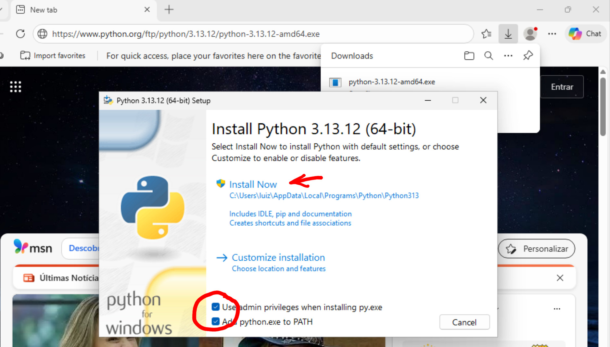
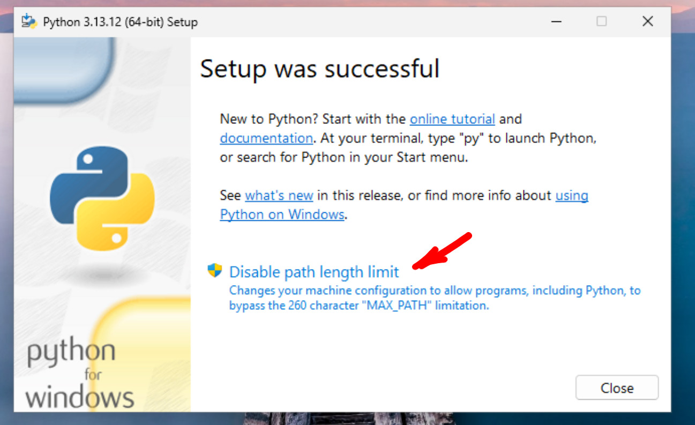
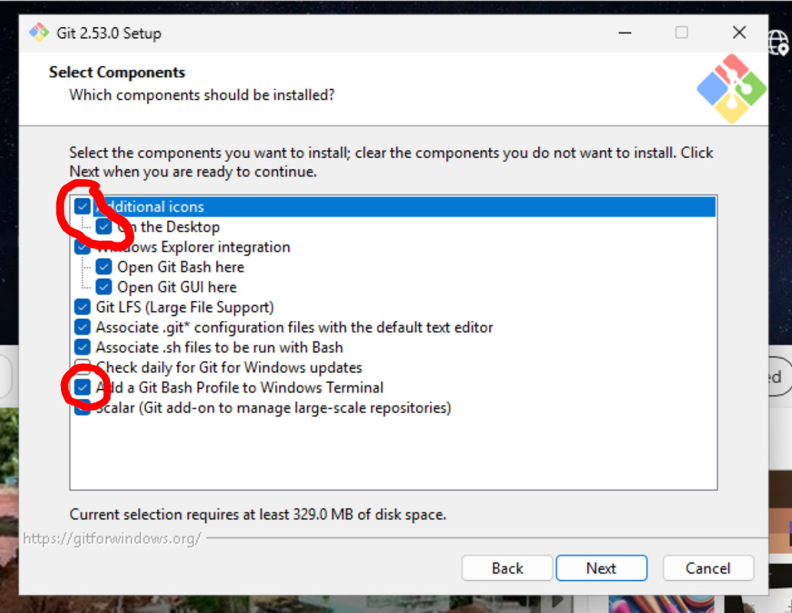
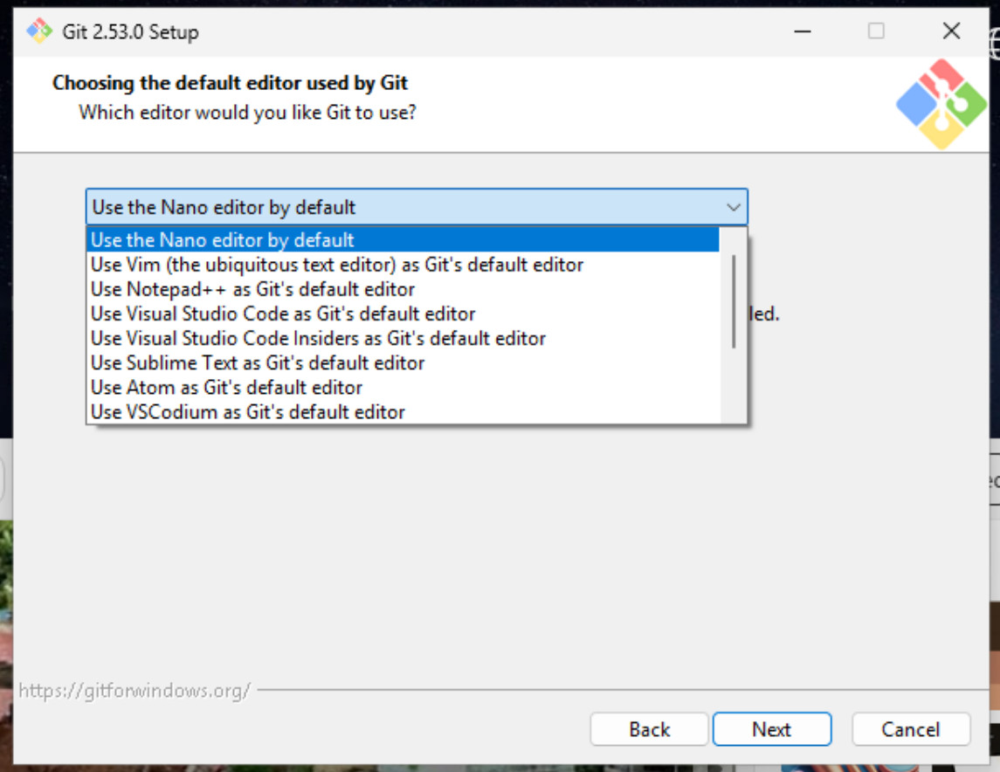

# Instalar o Python e o Git no Windows

No Windows, vc sempre vai usar o Git Bash pra rodar os comandos do projeto,
que é instalado junto com o Git, seguindo as instruções abaixo.

Se vc usa o VSCode, o Git Bash fica disponível no terminal tbm, mas vc
tem q escolher ele clicando no ícone, ao invés do Terminal ou do PowerShell.

## Python

Windows: baixar o instalador do Python: <https://www.python.org/ftp/python/3.13.12/python-3.13.12-amd64.exe>

e seguir as instruções. Marcar as opções conforme as imagens, e clicar em
"Desabilitar limite de PATH".




pra conferir se instalou certo, rodar o comando q vai mostrar a versão do python:

```shell
C:\Users\[seu_nome]>python --version
Python 3.13.12
```

## Git

Windows: baixar o instalador do Git: <https://github.com/git-for-windows/git/releases/download/v2.53.0.windows.1/Git-2.53.0-64-bit.exe>

Nas telas abaixo, marcar as opções "Adicionar icone -> Desktop" e
"Adicionar Git Bash Profile", e escolher o editor (Nano ou VSCode ou o que preferir)




## Abrindo o Git Bash e mudando de pasta

Pra mudar de pasta no Git Bash, por exemplo pra Documentos\projetos:

```console
luiz@test1 MINGW64 ~
$ cd Documents/projetos/

luiz@test1 MINGW64 ~/Documents/projetos
$
```
