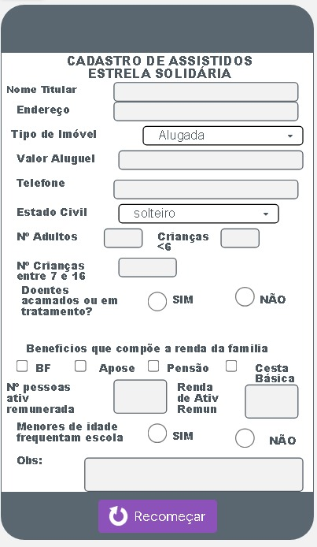
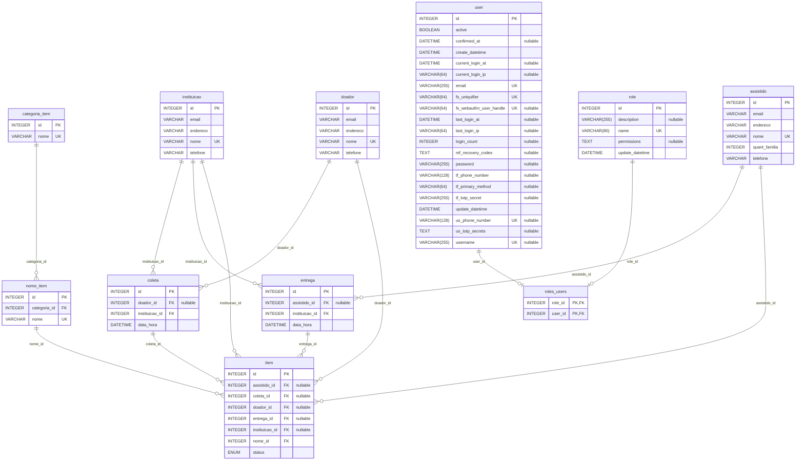

# Projeto Integrador 1, DRP05, Grupo 3N9

## Especificações

aqui podemos anotar os detalhes e requisitos do projeto.
Por enquanto fica aqui o mockup que a Emilia montou no AppLab.
A imagem representa uma ficha de cadastro de uma família assistida pelo projeto:



## Como clonar e rodar o projeto

> ATENÇÃO: Se estiver usando Windows, confira as instruções de como instalar o
[Python e Git](./README-WINDOWS.md)

### Clonar o projeto

Escolha uma pasta onde vai deixar seus projetos, por exemplo Documentos\projetos
e rode o git clone dentro dela (pra mudar de pasta veja as [instruções pro Windows](/README-WINDOWS.md#abrindo-o-git-bash-e-mudando-de-pasta)):

```console
git clone https://github.com/LuisGabriel01/sistema-doacoes
```

Depois disso mudar para a pasta do projeto com:

```console
cd sistema-doacoes
```

### a primeira vez, criar o `venv`

```shell
python -m venv .venv
```

### rodando o projeto

#### sempre que for mexer

tem que fazer a ativação do ambiente virtual do Python (`venv`)

##### no Linux

```shell
source .venv/bin/activate
```

##### no Windows (Git Bash)

```shell
source .venv\Scripts\activate
```

#### instalar as dependências

apenas uma vez, ou quando alterarmos as dependências

```shell
pip install .
```

as dependências ficam anotadas no arquivo `pyproject.toml`

#### rodar o projeto

com o `venv` ativado (por enquanto ainda não tem nada)

```shell
flask run
```

#### pra gerar o gráfico do ERM abaixo

usamos a biblioteca `paracelsus`. as configurações estão no arquivo
`pyproject.toml` também.

```shell
paracelsus graph
```

o resultado é um código que gera um gráfico `mermaid`, da pra ver abrindo
o código-fonte deste arquivo `README.md`

### esboço do ERM (Modelo Relacional de Entidades) do Banco de Dados

> **pessoal, ignorem a tabela `user` ela tem todos esses campos pq é gerada
> automaticamente pela biblioteca**



.
